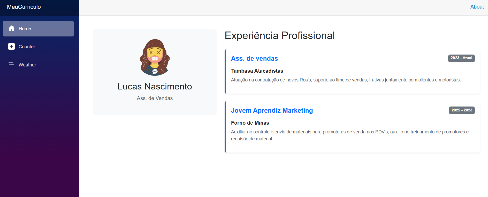

# 📄 MeuCurrículo Blazor


---

## 👤 Identificação

| Campo        | Informação                              |
|--------------|-----------------------------------------|
| **Nome**     | Lucas Nascimento                        |
| **Curso**    | Ciência da Computação                   |
| **Disciplina** | Interação Humano Computador e UX      |
| **Professor** | Daniel Henrique Matos de Paiva         |
| **Instituição** | Centro Universitário UNA            |
| **Atividade** | Lista 14 — Atualização do Currículo Blazor |

---

## 💻 Tecnologia Utilizada

**Blazor WebAssembly** — framework da Microsoft baseado em **C# e .NET** que permite criar aplicações web interativas rodando diretamente no navegador via WebAssembly, sem necessidade de JavaScript.

- Linguagem: `C#`
- Framework: `Blazor WebAssembly (.NET 8)`
- Estilização: `CSS` / `Bootstrap`
- IDE recomendada: `Visual Studio 2022` ou `Visual Studio Code`

---

## 🚀 Guia de Execução (Windows)

### Pré-requisitos

Antes de rodar o projeto, certifique-se de ter instalado:

- [.NET 8 SDK](https://dotnet.microsoft.com/download/dotnet/8.0)
- [Git](https://git-scm.com/)

Verifique a instalação abrindo o **Prompt de Comando (cmd)** ou **PowerShell** e digitando:

```bash
dotnet --version
```

---

### Passo a Passo

**1. Clone o repositório**
```bash
git clone https://github.com/seu-usuario/una-blazor-lista14.git
```

**2. Acesse a pasta do projeto**
```bash
cd una-blazor-lista14
```

**3. Restaure as dependências**
```bash
dotnet restore
```

**4. Execute a aplicação**
```bash
dotnet run
```

**5. Acesse no navegador**

Abra o navegador e acesse:
```
https://localhost:5001
```
ou
```
http://localhost:5000
```

> ⚠️ Caso a porta esteja em uso, o terminal indicará a porta alternativa automaticamente.

---

## 📸 Screenshot da Aplicação

<!-- Quando tiver o print, substitua a linha abaixo pela imagem: -->


---

## 🧭 Heurística de Nielsen Aplicada

### ✅ #10 — Ajuda e Documentação

> *"Embora o sistema deva ser fácil de usar sem documentação, ela deve ser fácil de buscar e focada na tarefa do usuário."*
> — Jakob Nielsen

Este projeto aplica essa heurística das seguintes formas:

- **README objetivo:** este arquivo documenta exatamente o necessário para instalar e rodar o projeto, sem informações desnecessárias.
- **Instruções por etapas:** o guia de execução segue uma ordem lógica e numerada, facilitando o acompanhamento do usuário.
- **Foco na tarefa:** cada seção responde a uma pergunta direta do usuário (*O que é? Como rodo? Quem fez?*), sem desviar do objetivo.
- **Interface autoexplicativa:** a aplicação Blazor foi desenvolvida com layout claro e navegação intuitiva, minimizando a necessidade de ajuda externa.

---

## 📁 Estrutura do Projeto

```
una-blazor-lista14/
├── Pages/
│   ├── Index.razor        # Página principal do currículo
│   └── ...
├── Shared/
│   ├── MainLayout.razor   # Layout principal
│   └── NavMenu.razor      # Menu de navegação
├── wwwroot/
│   └── css/               # Estilos da aplicação
├── App.razor
├── Program.cs
└── README.md
```

---

*Desenvolvido por **Lucas Nascimento** — Centro Universitário UNA, 2025.*
